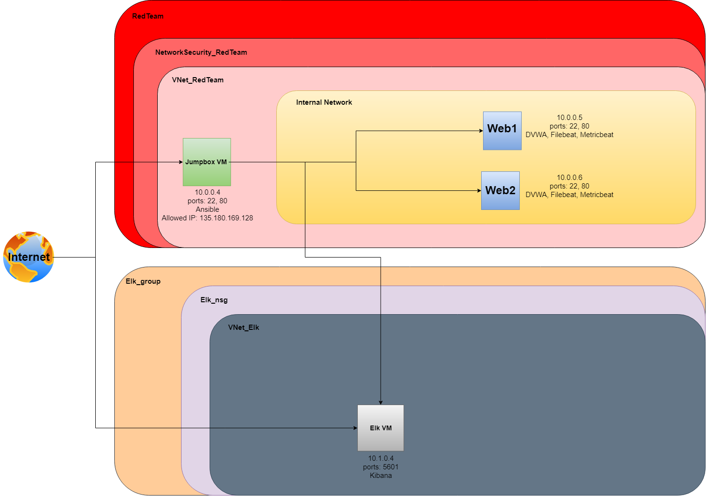

## Automated ELK Stack Deployment

The files in this repository were used to configure the network depicted below.

These files have been tested and used to generate a live ELK deployment on Azure. They can be used to either recreate the entire deployment pictured above. Alternatively, select portions of the yml file may be used to install only certain pieces of it, such as Filebeat.

  - _[Elk Install](./install-elk.yml)_

This document contains the following details:
- Description of the Topologu
- Access Policies
- ELK Configuration
  - Beats in Use
  - Machines Being Monitored
- How to Use the Ansible Build

### Description of the Topology

The main purpose of this network is to expose a load-balanced and monitored instance of DVWA, the D*mn Vulnerable Web Application.

Load balancing ensures that the application will be highly available, in addition to restricting access to the network.
- _Load balancers help protect against DDoS attacks. A jump box is a secure computer that all admins first connect to before launching any administrative task or use as an origination point to connect to other servers or untrusted environments_

Integrating an ELK server allows users to easily monitor the vulnerable VMs for changes to the log files and system resources.
- _Filebeat accounts for audit logs, deprecation logs, gc logs, server logs, and slow logs._
- _Metricbeat is used for displaying metric and system resource usage._

The configuration details of each machine may be found below.
_Note: Use the [Markdown Table Generator](http://www.tablesgenerator.com/markdown_tables) to add/remove values from the table_.

| Name     | Function              | IP Address | Operating System |
|----------|-----------------------|------------|------------------|
| Jump Box | Gateway               | 10.0.0.4   | Linux            |
| Elk      | ElasticSearch Stack   | 10.1.0.4   | Linux            |
| Web1     | Web Server            | 10.0.0.5   | Linux            |
| Web2     | Web Server            | 10.0.0.6   | Linux            |

### Access Policies

The machines on the internal network are not exposed to the public Internet. 

Only the jumpbox machine can accept connections from the Internet. Access to this machine is only allowed from the following IP addresses:
- 135.180.169.128

Machines within the network can only be accessed by the jumpbox machine.
- _Jump Box -- Public/Private IP: 20.119.49.213/10.0.0.4_

A summary of the access policies in place can be found in the table below.

| Name     | Publicly Accessible | Allowed IP Addresses |
|----------|---------------------|----------------------|
| Jump Box | Yes                 | 135.180.169.128      |
| Elk      | Yes                 | 135.180.169.128      |
| Web1     | No                  | 10.0.0.4             |
| Web2     | No                  | 10.0.0.4             |

### Elk Configuration

Ansible was used to automate configuration of the ELK machine. No configuration was performed manually, which is advantageous because...
- _Full automation reduces configuration mistakes._

The playbook implements the following tasks:
- _Install docker.io_
- _Install python3-pip_
- _Install Docker Module_
- _Increase Memory Usage_
- _Download and Launch Docker Elk Container_
- _Enable Docker service on Bootup_

The following screenshot displays the result of running `docker ps` after successfully configuring the ELK instance.

### Target Machines & Beats
This ELK server is configured to monitor the following machines:
- _10.0.0.5_
- _10.0.0.6_

We have installed the following Beats on these machines:
- _Filebeat and Metricbeat_

These Beats allow us to collect the following information from each machine:
- _Filebeat logs system events_
- _Metricbeat logs resource useage information_

### Using the Playbook
In order to use the playbook, you will need to have an Ansible control node already configured. Assuming you have such a control node provisioned: 

SSH into the control node and follow the steps below:
- Copy the _[install-elk.yml](install-elk.yml)_ file to _/etc/ansible/roles/_.
- Update the hosts file to include the attribute then include your destination ip of the ELK server.
- Run the playbook, and navigate to _http://[your_elk_server_ip]:5601/app/kibana_ to check that the installation worked as expected.
